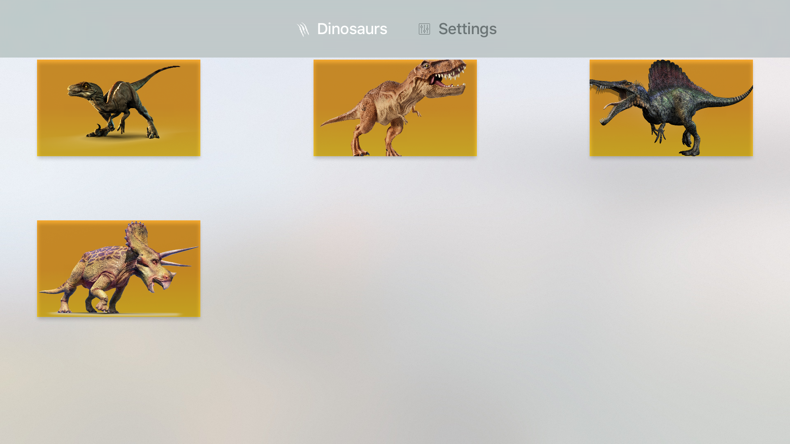
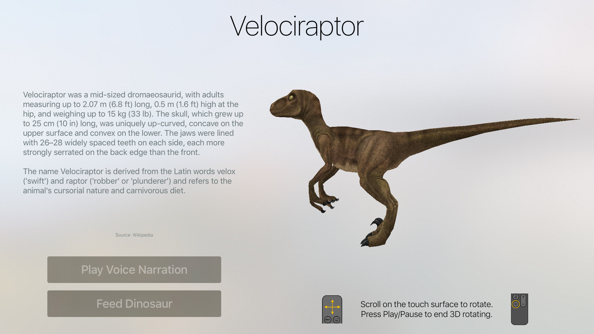

 

# Explore Dinosaurs 3D
Explore Dinosaurs 3D is an Apple TV application aimed to educate about Dinosaurs in an engaging way. It features high definition 3D models, professional voiceover narrations, and the ability to feed each dinosaur.
 
 

# Screenshots

 

 

## Requirements
Currently, Chill supports Xcode 7.2, tvOS 9.1+, and Swift 2.

 
## Features
- Utilizes tvOS
- High-detail 3D models of each dinosaur
- Professional voiceover narrations
- Ability to feed each dinosaur based on their diet
- Beautiful and simplistic graphics

 
## License
Explore Dinosaurs 3D is covered by the Standard MIT License. All rights belong to Nathan Hekman. See LICENSE for details.

 
## Author

Created by [Nathan Hekman](http://nathanhekman.com)
