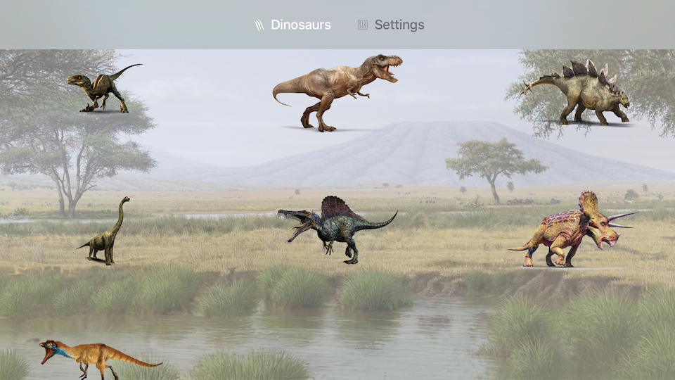
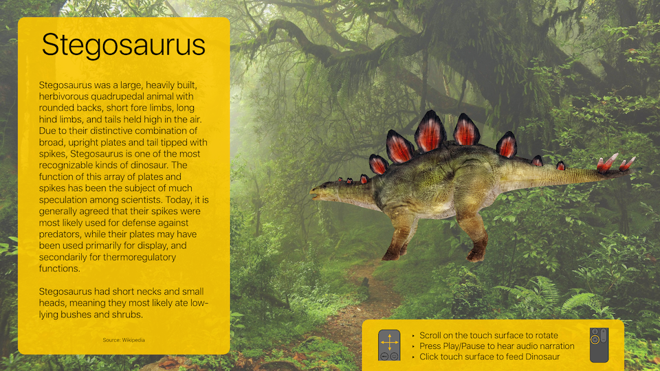
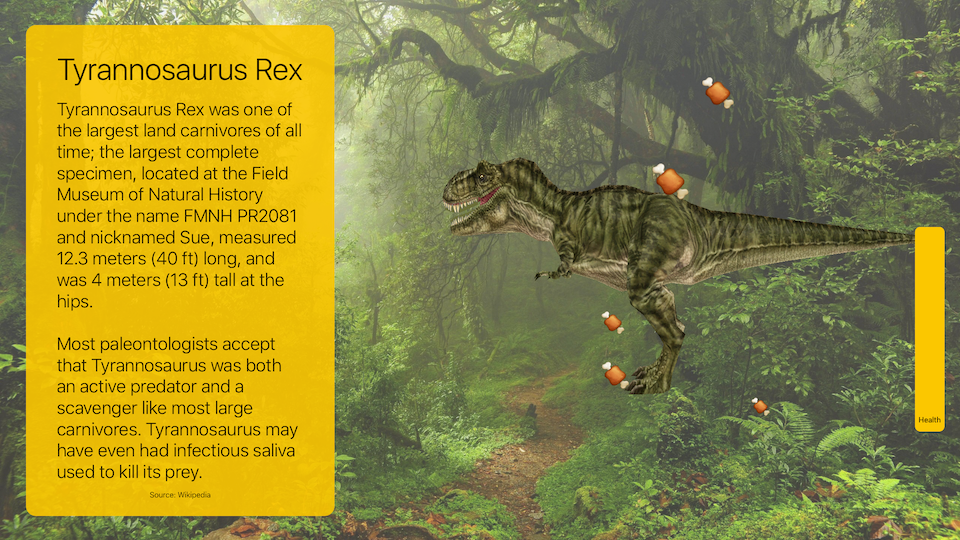

 

# Explore Dinosaurs 3D
Step into Explore Dinosaurs 3D. Use the touch surface to play with high definition 3D models. Listen to professional HD voiceover narrations for each dinosaur. Ever wanted a Velociraptor as a pet? Feed your dinos until they're stuffed, and see what happens!

Explore Dinosaurs 3D is now in the Apple TV App Store. Search for **"Explore Dinosaurs"** on the Apple TV App Store to try it out!
 
 

# Screenshots

 

 

 

 

## Requirements
Currently, Explore Dinosaurs 3D supports Xcode 7.3, tvOS 9.1+, and Swift 2.

 
## Features
- Utilizes tvOS (SceneKit, StoreKit, AudioToolbox, AVFoundation)
- High-detail 3D models of each dinosaur
- Educational at-a-glance info about each dinosaur and its diet
- Professional voiceover narrations
- Ability to feed each dinosaur based on their diet
- Smooth dinosaur animations
- Beautiful and simplistic graphics

 
## License
Explore Dinosaurs 3D is covered by the Standard MIT License. All rights belong to Nathan Hekman. See LICENSE for details.

 
## Author

Created by [Nathan Hekman](http://nathanhekman.com)
